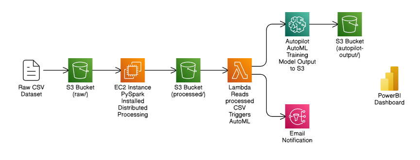

# Big Data Analytics Pipeline with AWS and PySpark

A fully automated big data analytics system that processes 100,000+ health records using AWS services, PySpark, and machine learning.

## 🎯 What This Project Does

- **Processes** large-scale health data using distributed PySpark on AWS EC2
- **Engineers** features like BMI categories, risk scores, and health indicators
- **Analyzes** data with Spark SQL queries and aggregations
- **Automates** ML model training using AWS SageMaker Autopilot
- **Visualizes** insights through interactive Power BI dashboards
- **Deploys** serverless pipeline with Lambda + S3 triggers for continuous processing

## 🏗️ Architecture

## 🎥 Demo Video

https://github.com/user-attachments/assets/25ee850d-0931-4f27-bbfe-70c253557fea

## 🛠️ Tech Stack

**Cloud:** AWS (S3, EC2, Lambda, SageMaker, SNS)  
**Processing:** PySpark, Python/Pandas  
**ML:** SageMaker Autopilot  
**Visualization:** Power BI Desktop

## 📊 Key Results

- Processed **100,000 health records** with 21 attributes
- Created **5 engineered features** for risk assessment
- Achieved **50.23% accuracy** with automated ML
- Built **5 interactive visualizations** in Power BI
- Discovered **72% of population** shows disease risk

## 🚀 Quick Start

1. Upload raw CSV to S3 `raw/` folder
2. Lambda automatically processes data
3. SageMaker Autopilot trains model
4. Get email notification when complete
5. View results in Power BI dashboard

## 📁 Repository Contents

- `vsonawa_bda_project.pdf` - Full project report
- `Architecture_Diagram.png` - System architecture
- `vsonawa_bda_project.mp4` - Video walkthrough

## 👤 Author

**Varunkumar Sonawane** 

---

*Big Data Analytics Course Project - Indiana University*
